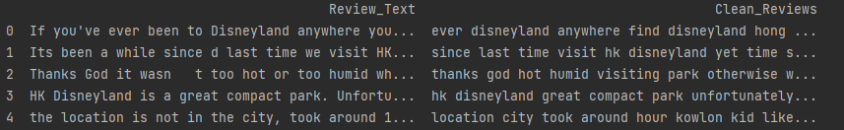
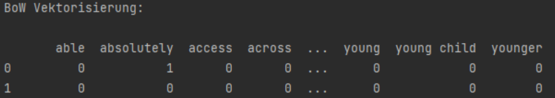
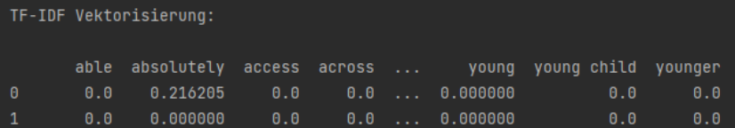
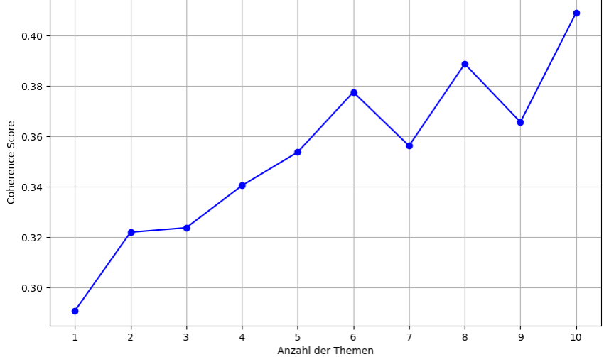
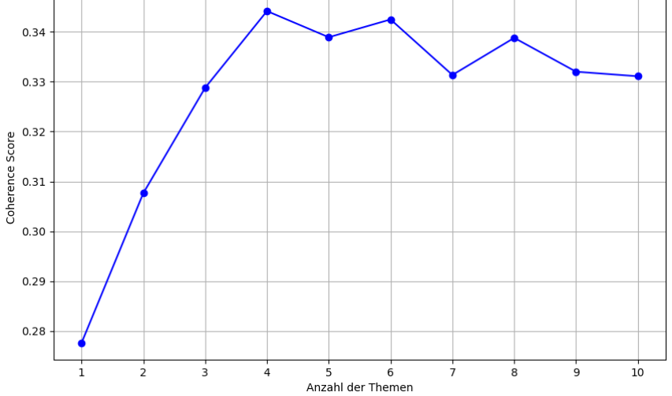
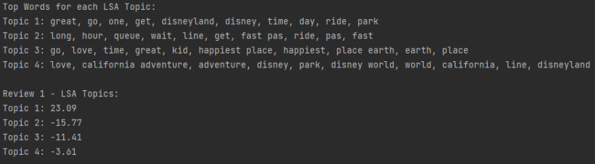
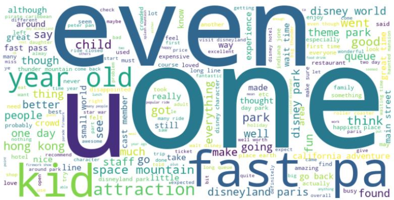

# NLP-Techniken

Dieses Projekt analysiert Disneyland-Bewertungen mithilfe verschiedener NLP-Verfahren. Nach der Datenvorverarbeitung werden die Texte mit Bag of Words (BoW) und Term Frequency-Inverse Document Frequency (TF-IDF) vektorisiert und anschließend mittels Latent Semantic Analysis (LSA) und Latent Dirichlet Allocation (LDA) thematisch untersucht. Der Coherence Score dient dabei zur Bestimmung einer geeigneten Themenanzahl. 
Abschließend werden die Ergebnisse mithilfe von Wordcloud visualisiert.

## Inhaltsverzeichnis
- [Konzeptionsphase](#konzeptionsphase)
- [Datenvorverarbeitung](#datenvorverarbeitung)
- [Vektorisierung](#vektorisierung)
  - [BoW](#bow)
  - [TF-IDF](#tf-idf)
- [Berechnung des Coherence Scores](#berechnung-des-coherence-scores)
- [Themenmodellierung](#themenmodellierung)
  - [LDA](#lda)
  - [LSA](#lsa)
- [Visualisierung der Ergebnisse](#visualisierung-der-ergebnisse)
- [Fazit](#fazit)

## Konzeptionsphase
Zunächst wird der Datensatz mit den Disneyland-Bewertungen als CSV-Datei über [Kaggle](https://www.kaggle.com/datasets/arushchillar/disneyland-reviews) bezogen und ein erster Überblick über die Daten gewonnen.

Eine Besucherbewertung über das Disneyland lautet beispielsweise: „This place is HUGE! Definately need more than one day. We had 3 children aged 11, 9 & 6“. Anhand dieses Beispiels wird die Notwendigkeit der Datenvorverarbeitung zur Textbereinigung verdeutlicht, welche wie folgt aussieht:
 - Konvertierung des Textes in Kleinbuchstaben „this place is huge …“
 - Entfernung von Sonderzeichen, Zahlen (z. B „!“, „3“) und Stoppwörtern (z. B. „we“)
 - Tokenisierung des Textes in einzelne Wörter
 - Durchführung der Lemmatisierung (z. B. „is“ wird zu „be“)

Für die Umsetzung der einzelnen Verarbeitungsschritte werden folgende Python-Bibliotheken eingesetzt:
 - Einlesen der Daten in Python ⇨ pandas
 - Textbereinigung ⇨ nltk
 - Datenkonvertierung und Themenextraktion ⇨ scikit-learn
 - Kohärenzberechnung ⇨ gensim
 - Visualisierung der häufigsten Wörter ⇨ wordcloud, matplotlib, pillow, numpy

Zu Beginn werden in PyCharm die benötigten Bibliotheken installiert und in das Python-Projekt eingebunden. Anschließend werden die Disneyland-Bewertungen mithilfe von `read_csv()` aus pandas eingelesen und für die weitere Verarbeitung bereitgestellt.

## Datenvorverarbeitung
Mithilfe der Funktion `preprocess_text` wird die Textvorverarbeitung durchgeführt. In dieser wird der Text in einzelne Wörter, sogenannte Tokens, aufgeteilt und in Kleinbuchstaben umgewandelt. Zudem erfolgt eine Entfernung der Stoppwörter mithilfe der englischen Stoppwortliste aus der Bibliothek von `nltk`. Zusätzlich werden Sonderzeichen und Zahlen herausgefiltert, sodass für die weitere Analyse ausschließlich alphabetische Wörter erhalten bleiben. Außerdem findet die Lemmatisierung statt, bei der die Wörter in ihre kanonische Grundform umgewandelt werden. Abschließend gibt die Funktion den vorverarbeiteten Text mit return `' '.join(words)` wieder als zusammenhängenden String zurück.

Nach der Erstellung der Funktion wird `preprocess_text` auf die Spalte Review_Text angewendet. Die bereinigten Daten werden anschließend in einer neuen CSV-Datei gespeichert und für die weiteren Analyseschritte bereitgestellt.

Überprüfung der bereinigten Daten durch eine Gegenüberstellung mit den Originaldaten:

## Vektorisierung 
Um die vorverarbeiteten Texte in eine numerische Darstellung zu überführen, erfolgt im nächsten Schritt die Vektorisierung mit Bag-of-Words (BoW) und TF-IDF. Hierfür werden die Klassen `CountVectorizer` und `TfidfVectorizer` aus der `scikit-learn`-Bibliothek verwendet. Bei der Vektorisierung werden sowohl Unigramme als auch Bigramme berücksichtigt. Zusätzlich wird die Anzahl auf 1000 Wörter beziehungsweise n-Gramme begrenzt. Das Ergebnis wird in einem DataFrame mit `pandas` gespeichert und ausgegeben. 

### BoW
Bei der BoW-Vektorisierung ist zu erkennen, dass das Wort „absolutely“ in der ersten Kundenbewertung  den Wert 1 erhält. Dieser Wert gibt an, dass „absolutely“ genau einmal in der entsprechenden Rezension vorkommt.

### TF-IDF
Anders verhält es sich bei der TF-IDF-Vektorisierung, bei der das Wort „absolutely“ einen Wert von 0.216205 erhält. Dieser Wert ergibt sich aus der Häufigkeit des Wortes innerhalb der jeweiligen Rezension sowie aus seiner Häufigkeit im gesamten Korpus. Im Gegensatz zu BoW berücksichtigt TF-IDF somit nicht nur, wie häufig ein Wort in einer Rezension vorkommt, sondern auch, wie häufig es in den übrigen Rezensionen vertreten ist.

## Berechnung-des-Coherence-Scores
Vor der eigentlichen Themenmodellierung wurde zunächst die optimale Anzahl an Themen für die Modelle LDA und LSA bestimmt. Hierfür wurde der Coherence Score für verschiedene Themenanzahlen berechnet. Die Umsetzung erfolgte mit `LdaMulticore` und `LsiModel` aus der Bibliothek `gensim`. Für beide Modelle wurde die Anzahl der Themen von 1 bis 10 durchlaufen und der zugehörige Coherence Score ermittelt. 
Dabei erzielte LDA bei einer Themenanzahl von 10 den höchsten Coherence Score:

Während für LSA eine Themenanzahl von 4 den höchsten Coherence Score erzielte:

## Themenmodellierung
Für die LDA-Modellierung wurde `LatentDirichletAllocation` und für die LSA-Modellierung `TruncatedSVD` aus der Bibliothek `scikit-learn` verwendet. Über den Parameter `n_components` wurde für beide Modelle die zuvor ermittelte optimale Anzahl an Themen festgelegt. Anschließend wurden die Modelle mithilfe von `fit_transform()` auf die vorbereiteten Vektordarstellungen angewendet. Für jedes Thema wurden anschließend die zehn relevantesten Wörter extrahiert, um die inhaltlichen Schwerpunkte der einzelnen Themen besser interpretieren zu können. Zusätzlich wurde die Themenverteilung der ersten Bewertung ermittelt, um zu untersuchen, welchen Anteil die einzelnen Themen an der Rezension haben.

### LDA
Ersichtlich wird bei LDA, dass die 10 extrahierten Themen von Aktivitäten und positiven Erlebnissen bis hin zu verschiedenen Disneyland-Parks weltweit, Service und geschlossenen Attraktionen reichen. Außerdem ist in der ersten Kundenbewertung auffällig, dass sich dessen Inhalt am stärksten auf das Thema 6 mit einem Wert von 74,02 fokussiert.

### LSA
Die vier extrahierten Themen mit LSA sind überschaubar und beinhalten Aspekte wie Abenteuer, Warteschlangen und Wartezeiten, positive Erlebnisse im Park sowie die Freude am Besuch von Disneyland. Hier fällt die erste Bewertung vor allem auf Thema 1 mit einem Wert von 23,09.

## Visualisierung der Ergebnisse
Abschließend wurde eine Wordcloud erstellt, um die am häufigsten verwendeten Begriffe aus den Rezensionen übersichtlich und anschaulich darzustellen. Hierfür wurden die Bibliotheken `matplotlib`, `pillow`, `numpy` und `wordcloud` verwendet.

## Fazit
Die gewonnenen Ergebnisse ermöglichen es, zentrale Begriffe und thematische Schwerpunkte der Disneyland-Bewertungen zu identifizieren. Auf dieser Grundlage können beispielsweise Rückschlüsse auf häufig genannte Aspekte und mögliche Verbesserungspotenziale gezogen werden. Durch eine gezielte Anpassung der verwendeten Parameter können die Ergebnisse weiter optimiert werden. Dabei hat insbesondere die Qualität der Datenvorverarbeitung einen wesentlichen Einfluss auf die Aussagekraft der Analyse.

Während der Umsetzung traten verschiedene Herausforderungen auf. Bei der Berechnung des Coherence Scores für LDA nahm die Verarbeitung aufgrund der Vielzahl an Berechnungen vergleichsweise viel Zeit in Anspruch. Durch die Verwendung von `LdaMulticore` konnte die Berechnung auf mehrere CPU-Kerne verteilt und dadurch beschleunigt werden. Eine weitere Herausforderung stellte die Erstellung der Wordcloud dar. Dabei trat wiederholt der Fehler `ValueError("Only supported for TrueType fonts")` auf. Die Ursache konnte durch eine Aktualisierung der verwendeten Pakete, insbesondere `pip` und `pillow`, behoben werden.

Insgesamt konnte durch das Projekt ein umfassender Einblick in die praktische Anwendung verschiedener NLP-Techniken gewonnen werden. Insbesondere die Arbeit mit realen Bewertungsdaten verdeutlicht, wie NLP-Verfahren dabei helfen können, wiederkehrende Begriffe, thematische Zusammenhänge und relevante Informationen aus Texten zu identifizieren.
